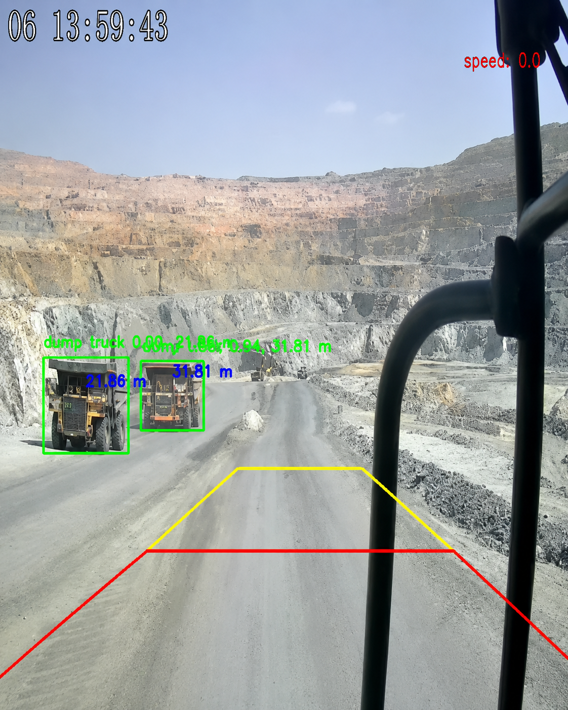

# YOLO Obstacle Distance Estimation for Mining

A Python application for detecting `person` and `dump truck` objects, estimating their approximate distance from the camera, drawing warning/danger zones, and exporting an annotated output video.

The project uses a custom YOLO11n model saved as:

```text
best.pt
```

## Demo

Add your sample output image or GIF here:

```md

```

```md

```

Recommended folder:

```text
assets/
├── sample_output.png
└── demo.gif
```

## Features

- Object detection with Ultralytics YOLO
- Approximate distance estimation from detected bounding boxes
- Red/yellow warning-zone visualization
- PySide6 GUI for viewing processed frames
- Annotated video export
- Application and detection logging

## Project Structure

```text
yolo-obstacle-distance-estimation-mining/
├── app/
│   ├── main.py
│   ├── processor.py
│   ├── distance.py
│   ├── ground_zone.py
│   └── logger.py
├── configs/
│   └── config.yaml
├── assets/
│   ├── sample_output.png
│   └── demo.gif
├── output/
├── best.pt
├── requirements.txt
└── README.md
```

## Installation

Create and activate a virtual environment, then install dependencies:

```bash
pip install -r requirements.txt
```

Required packages:

```txt
numpy
opencv-python
torch
ultralytics
PySide6
PyYAML
```

## Configuration

The project uses:

```text
configs/config.yaml
```

Example configuration:

```yaml
model_path: "best.pt"

camera_sources:
  - "videos/movie.mp4"

app_type: 1
target_fps: 5
log_level: "DEBUG"

classes:
  - "person"
  - "dump truck"

camera_height: 2
target_resolution: [640, 640]
output_path: "output/movie.mp4"
```

Important fields:

| Field | Meaning |
|---|---|
| `model_path` | Path to the YOLO model weights |
| `camera_sources` | Input video, camera, or RTSP source |
| `app_type` | Application mode |
| `target_fps` | Target capture/processing FPS |
| `classes` | Object classes used by the model |
| `camera_height` | Camera height in meters |
| `target_resolution` | Frame size used before inference |
| `output_path` | Path for the annotated output video |

## Application Modes

| Mode | Description |
|---:|---|
| `0` | Print detections in the console and save annotated video |
| `1` | Show GUI and save annotated video |

## Usage

Run from the project root:

```bash
python app/main.py
```

Or from inside the `app/` folder:

```bash
python main.py
```

## Output

The annotated video is saved to the path defined in `config.yaml`:

```text
output/movie.mp4
```

The program also creates log files:

```text
app.log
detections.log
```

## Notes

Distance estimation is approximate. It depends on camera position, camera height, object detection quality, bounding-box stability, and perspective. The warning zones are visual guidance and should not be treated as a fully calibrated safety system without further calibration and testing.

## Author

Mohammad Mohtashami  
K. N. Toosi University of Technology  
Supervisor: Dr. Ali Nahvi
